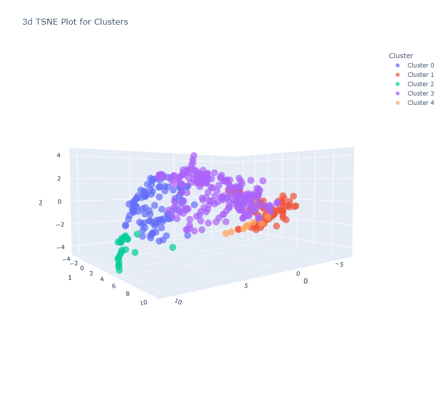
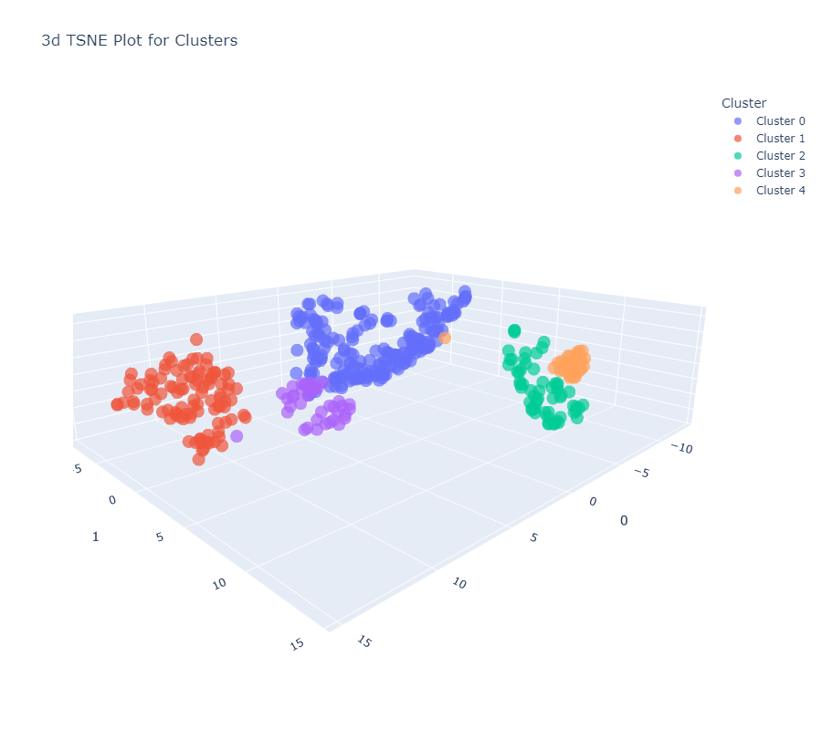
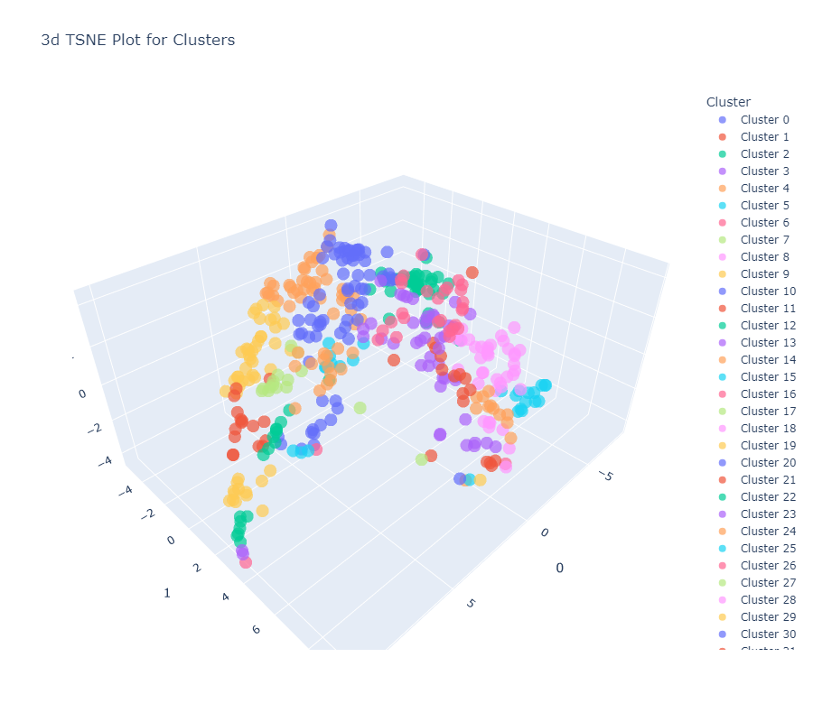
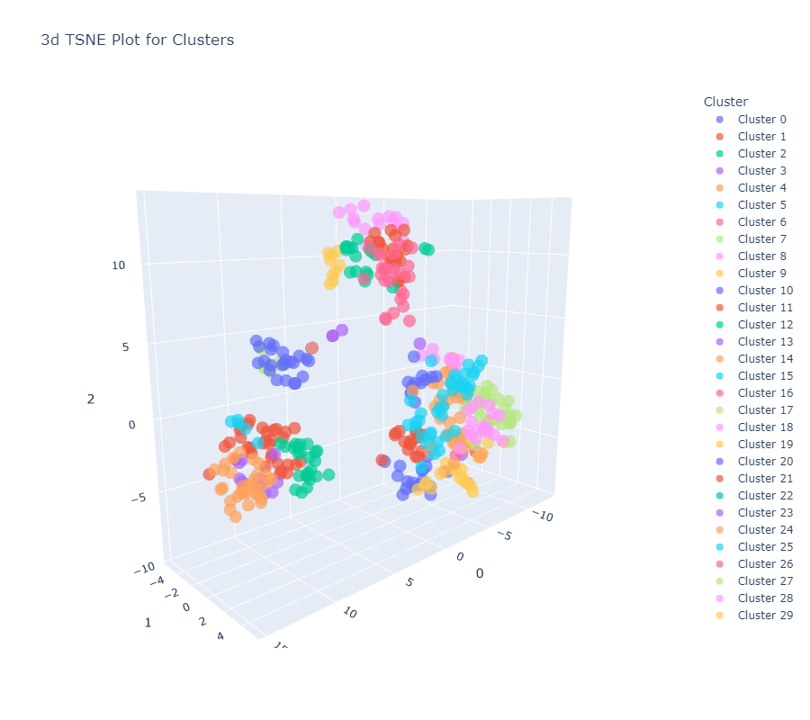
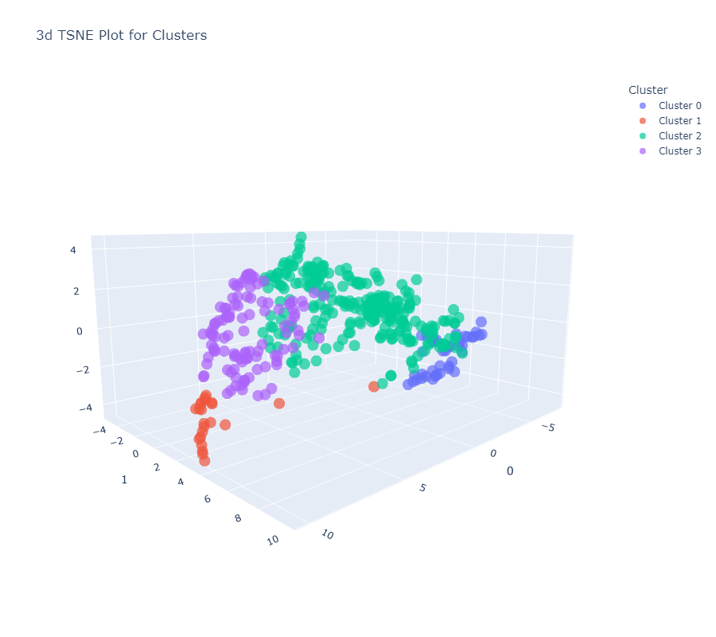
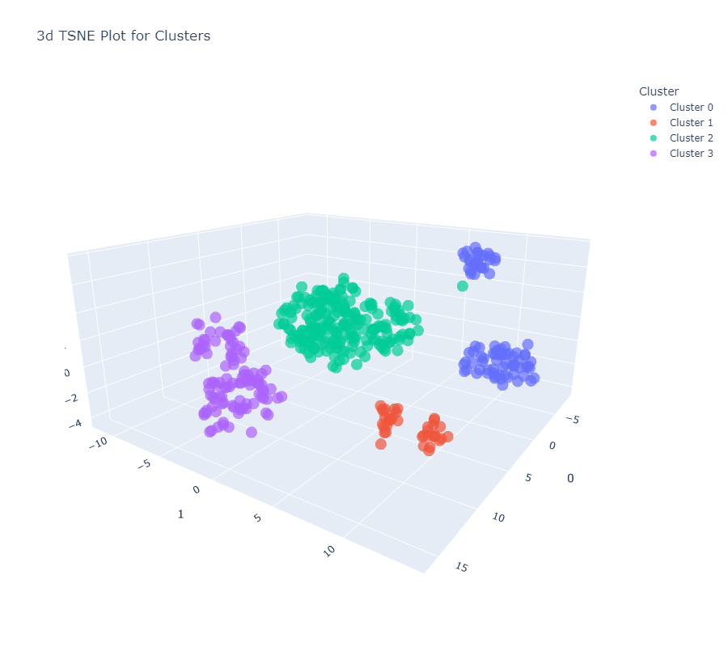
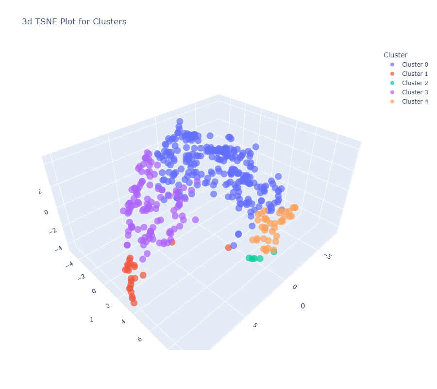
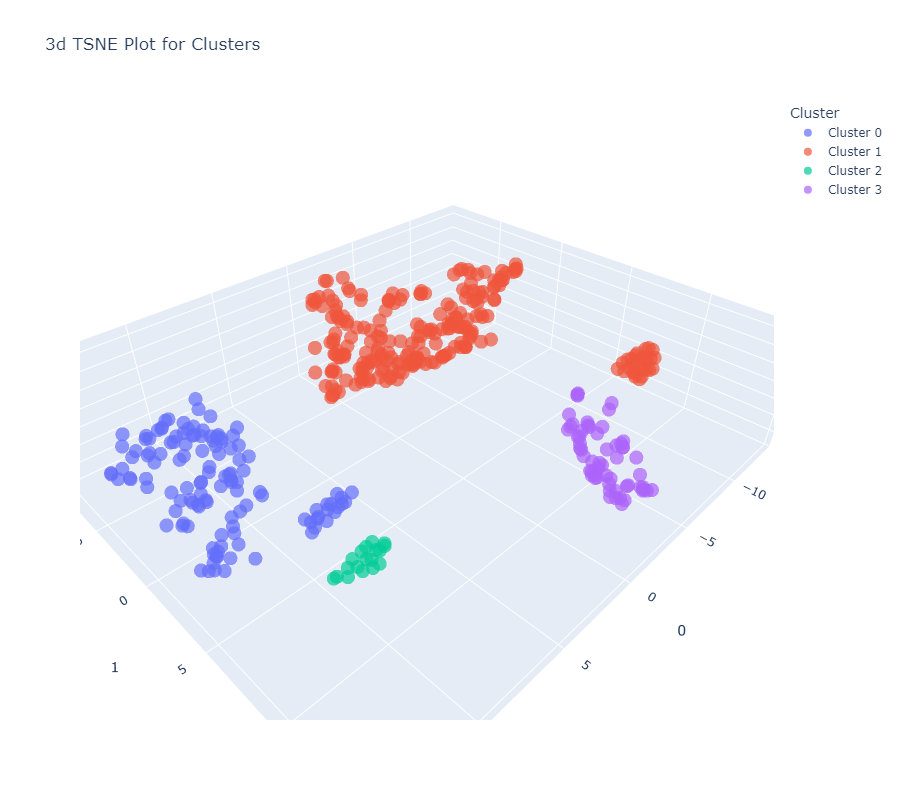
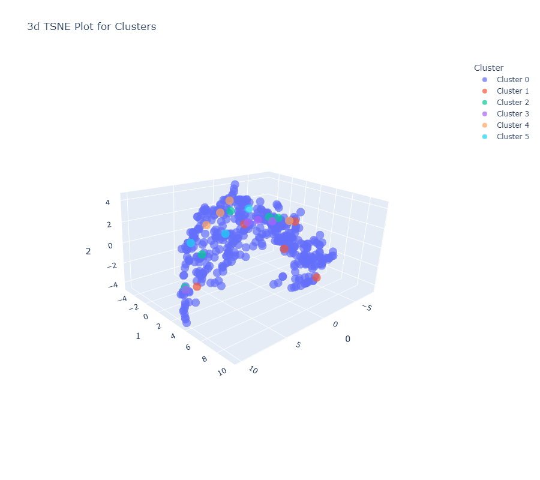
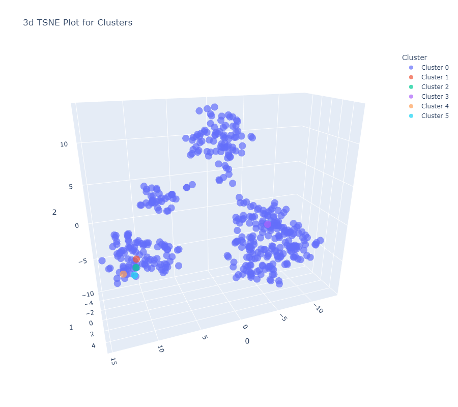

# Clustering Algorithms Evaluation with PyCaret for WholeSale Dataset

This document evaluates five different clustering algorithms using the PyCaret library, a machine learning library in Python that simplifies the process of setting up, comparing, and evaluating machine learning models. The algorithms evaluated are K-Means Clustering (`kmeans`), Affinity Propagation (`ap`), Agglomerative Clustering (`hclust`), Birch Clustering (`birch`), and K-Modes Clustering (`kmodes`). The evaluation metrics used for comparison include the Silhouette score, Calinski-Harabasz index, and Davies-Bouldin index, which are common across all algorithms.

## Evaluation Metrics

- **Silhouette Score**: Measures how similar an object is to its own cluster compared to other clusters. The value ranges from -1 to 1, where a high value indicates that the object is well matched to its own cluster and poorly matched to neighboring clusters.

- **Calinski-Harabasz Index**: Also known as the Variance Ratio Criterion, it measures the cluster validity based on the ratio of the sum of between-clusters dispersion and of within-cluster dispersion. Higher values generally indicate better-defined clusters.

- **Davies-Bouldin Index**: A measure of the clustering quality which indicates the average 'similarity' between clusters, where similarity is a measure that compares the distance between clusters with the size of the clusters themselves. Lower values indicate better clustering.

## Clustering Algorithms Evaluation

### 1. K-Means Clustering (`kmeans`)

#### Result Table
|                   | No Data Pre Processing | No Data Pre Processing | No Data Pre Processing | No Data Pre Processing | Normalized-zscore | Normalized-zscore | Normalized-zscore | Normalized-zscore | Normalized-minmax | Normalized-minmax | Normalized-minmax | Normalized-minmax | Normalized-maxabs | Normalized-maxabs | Normalized-maxabs | Normalized-maxabs | PCA-linear | PCA-linear | PCA-linear | PCA-linear | PCA-incremental | PCA-incremental | PCA-incremental | PCA-incremental | tranformation-yeo | tranformation-yeo | tranformation-yeo | tranformation-yeo | tranformation-quantile | tranformation-quantile | tranformation-quantile | tranformation-quantile | Normalized-zscore + tranformation-yeo | Normalized-zscore + tranformation-yeo | Normalized-zscore + tranformation-yeo | Normalized-zscore + tranformation-yeo | Normalized-zscore + PCA-linear | Normalized-zscore + PCA-linear | Normalized-zscore + PCA-linear | Normalized-zscore + PCA-linear | Normalized-zscore + tranformation-yeo + PCA-linear | Normalized-zscore + tranformation-yeo + PCA-linear | Normalized-zscore + tranformation-yeo + PCA-linear | Normalized-zscore + tranformation-yeo + PCA-linear |
|-------------------|------------------------|------------------------|------------------------|------------------------|-------------------|-------------------|-------------------|-------------------|-------------------|-------------------|-------------------|-------------------|-------------------|-------------------|-------------------|-------------------|------------|------------|------------|------------|-----------------|-----------------|-----------------|-----------------|-------------------|-------------------|-------------------|-------------------|------------------------|------------------------|------------------------|------------------------|---------------------------------------|---------------------------------------|---------------------------------------|---------------------------------------|--------------------------------|--------------------------------|--------------------------------|--------------------------------|----------------------------------------------------|----------------------------------------------------|----------------------------------------------------|----------------------------------------------------|
|                   | c=3                    | c=4                    | c=5                    | c=6                    | c=3               | c=4               | c=5               | c=6               | c=3               | c=4               | c=5               | c=6               | c=3               | c=4               | c=5               | c=6               | c=3        | c=4        | c=5        | c=6        | c=3             | c=4             | c=5             | c=6             | c=3               | c=4               | c=5               | c=6               | c=3                    | c=4                    | c=5                    | c=6                    | c=3                                   | c=4                                   | c=5                                   | c=6                                   | c=3                            | c=4                            | c=5                            | c=6                            | c=3                                                | c=4                                                | c=5                                                | c=6                                                |
| Silhouette        | 0.4784                 | 0.3866                 | 0.3833                 | 0.3866                 | 0.3568            | 0.3683            | 0.3529            | 0.3572            | 0.6593            | 0.68              | 0.6468            | 0.6535            | 0.5545            | 0.5799            | 0.5885            | 0.535             | 0.4798     | 0.3866     | 0.3866     | 0.3751     | 0.4784          | 0.3866          | 0.3706          | 0.3853          | 0.8554            | 0.5181            | 0.4635            | 0.4158            | 0.6085                 | 0.6377                 | 0.5586                 | 0.4009                 | 0.2228                                | 0.2472                                | 0.2184                                | 0.2033                                | 0.3568                         | 0.3482                         | 0.3688                         | 0.3537                         | 0.2228                                             | 0.2476                                             | 0.2187                                             | 0.2013                                             |
| Calinski-Harabasz | 210.1526               | 207.8197               | 215.0578               | 207.8197               | 139.3494          | 131.5821          | 137.9523          | 144.7005          | 760.0331          | 877.9768          | 825.8484          | 831.3299          | 383.8222          | 357.2453          | 352.1927          | 344.6292          | 210.148    | 207.8197   | 214.1993   | 205.7447   | 210.1526        | 207.8197        | 214.535         | 203.1944        | 13039.7633        | 15162.6315        | 14221.556         | 13907.87          | 747.5305               | 899.6002               | 792.4932               | 724.211                | 153.5484                              | 136.3349                              | 121.2396                              | 111.1239                              | 139.3494                       | 130.9179                       | 138.3391                       | 145.6033                       | 153.5484                                           | 136.3494                                           | 121.1591                                           | 111.088                                            |
| Davies-Bouldin    | 0.8895                 | 0.9543                 | 0.902                  | 0.9543                 | 1.1736            | 1.1454            | 1.1481            | 0.8788            | 0.5097            | 0.611             | 0.5923            | 0.6337            | 0.7116            | 0.8165            | 0.752             | 0.8882            | 0.8889     | 0.9543     | 0.8873     | 0.8519     | 0.8895          | 0.9543          | 0.9108          | 0.8514          | 0.3389            | 0.6203            | 0.6936            | 0.7501            | 0.559                  | 0.5808                 | 0.7147                 | 0.9993                 | 1.6406                                | 1.4208                                | 1.585                                 | 1.5945                                | 1.1736                         | 1.2359                         | 1.0586                         | 0.9748                         | 1.6406                                             | 1.4215                                             | 1.5847                                             | 1.6011                                             |

#### Graphs

1. 
   Without Preprocessing
3. 
   With Preprocessing

### 2. Affinity Propagation (`ap`)

#### Result Table
|                   | No Data Pre Processing | No Data Pre Processing | No Data Pre Processing | No Data Pre Processing | Normalized-zscore | Normalized-zscore | Normalized-zscore | Normalized-zscore | Normalized-minmax | Normalized-minmax | Normalized-minmax | Normalized-minmax | Normalized-maxabs | Normalized-maxabs | Normalized-maxabs | Normalized-maxabs | PCA-linear | PCA-linear | PCA-linear | PCA-linear | PCA-incremental | PCA-incremental | PCA-incremental | PCA-incremental | tranformation-yeo | tranformation-yeo | tranformation-yeo | tranformation-yeo | transformation-quantile | transformation-quantile | transformation-quantile | transformation-quantile | Normalized-zscore + tranformation-yeo | Normalized-zscore + tranformation-yeo | Normalized-zscore + tranformation-yeo | Normalized-zscore + tranformation-yeo | Normalized-zscore + PCA-linear | Normalized-zscore + PCA-linear | Normalized-zscore + PCA-linear | Normalized-zscore + PCA-linear | Normalized-zscore + tranformation-yeo + PCA-linear | Normalized-zscore + tranformation-yeo + PCA-linear | Normalized-zscore + tranformation-yeo + PCA-linear | Normalized-zscore + tranformation-yeo + PCA-linear |
|-------------------|------------------------|------------------------|------------------------|------------------------|-------------------|-------------------|-------------------|-------------------|-------------------|-------------------|-------------------|-------------------|-------------------|-------------------|-------------------|-------------------|------------|------------|------------|------------|-----------------|-----------------|-----------------|-----------------|-------------------|-------------------|-------------------|-------------------|-------------------------|-------------------------|-------------------------|-------------------------|---------------------------------------|---------------------------------------|---------------------------------------|---------------------------------------|--------------------------------|--------------------------------|--------------------------------|--------------------------------|----------------------------------------------------|----------------------------------------------------|----------------------------------------------------|----------------------------------------------------|
|                   | c=3                    | c=4                    | c=5                    | c=6                    | c=3               | c=4               | c=5               | c=6               | c=3               | c=4               | c=5               | c=6               | c=3               | c=4               | c=5               | c=6               | c=3        | c=4        | c=5        | c=6        | c=3             | c=4             | c=5             | c=6             | c=3               | c=4               | c=5               | c=6               | c=3                     | c=4                     | c=5                     | c=6                     | c=3                                   | c=4                                   | c=5                                   | c=6                                   | c=3                            | c=4                            | c=5                            | c=6                            | c=3                                                | c=4                                                | c=5                                                | c=6                                                |
| Silhouette        | 0.234                  | 0.234                  | 0.234                  | 0.234                  | 0.2627            | 0.2627            | 0.2627            | 0.2627            | 0.461             | 0.461             | 0.461             | 0.461             | 0.295             | 0.295             | 0.295             | 0.295             | 0.234      | 0.234      | 0.234      | 0.234      | 0.234           | 0.234           | 0.234           | 0.234           | 0.2777            | 0.2777            | 0.2777            | 0.2777            | 0.362                   | 0.362                   | 0.362                   | 0.362                   | 0.1568                                | 0.1568                                | 0.1568                                | 0.1568                                | 0.2627                         | 0.2627                         | 0.2627                         | 0.2627                         | 0.1568                                             | 0.1568                                             | 0.1568                                             | 0.1568                                             |
| Calinski-Harabasz | 196.8248               | 196.8248               | 196.8248               | 196.8248               | 114.3427          | 114.3427          | 114.3427          | 114.3427          | 785.3246          | 785.3246          | 785.3246          | 785.3246          | 291.7248          | 291.7248          | 291.7248          | 291.7248          | 196.8248   | 196.8248   | 196.8248   | 196.8248   | 196.8248        | 196.8248        | 196.8248        | 196.8248        | 11338.091         | 11338.091         | 11338.091         | 11338.091         | 605.0139                | 605.0139                | 605.0139                | 605.0139                | 49.3278                               | 49.3278                               | 49.3278                               | 49.3278                               | 114.3427                       | 114.3427                       | 114.3427                       | 114.3427                       | 49.3278                                            | 49.3278                                            | 49.3278                                            | 49.3278                                            |
| Davies-Bouldin    | 0.7978                 | 0.7978                 | 0.7978                 | 0.7978                 | 0.8759            | 0.8759            | 0.8759            | 0.8759            | 0.7936            | 0.7936            | 0.7936            | 0.7936            | 0.863             | 0.863             | 0.863             | 0.863             | 0.7978     | 0.7978     | 0.7978     | 0.7978     | 0.7978          | 0.7978          | 0.7978          | 0.7978          | 1.0484            | 1.0484            | 1.0484            | 1.0484            | 1.075                   | 1.075                   | 1.075                   | 1.075                   | 1.3876                                | 1.3876                                | 1.3876                                | 1.3876                                | 0.8759                         | 0.8759                         | 0.8759                         | 0.8759                         | 1.3876                                             | 1.3876                                             | 1.3876                                             | 1.3876                                             |

#### Graphs

1. 
    Without Preprocessing
3. 
    With Preprocessing

### 3. Agglomerative Clustering (`hclust`)

#### Result Table
|                   | No Data Pre Processing | No Data Pre Processing | No Data Pre Processing | No Data Pre Processing | Normalized-zscore | Normalized-zscore | Normalized-zscore | Normalized-zscore | Normalized-minmax | Normalized-minmax | Normalized-minmax | Normalized-minmax | Normalized-maxabs | Normalized-maxabs | Normalized-maxabs | Normalized-maxabs | PCA-linear | PCA-linear | PCA-linear | PCA-linear | PCA-incremental | PCA-incremental | PCA-incremental | PCA-incremental | tranformation-yeo | tranformation-yeo | tranformation-yeo | tranformation-yeo | transformation-quantile | transformation-quantile | transformation-quantile | transformation-quantile | Normalized-zscore + tranformation-yeo | Normalized-zscore + tranformation-yeo | Normalized-zscore + tranformation-yeo | Normalized-zscore + tranformation-yeo | Normalized-zscore + PCA-linear | Normalized-zscore + PCA-linear | Normalized-zscore + PCA-linear | Normalized-zscore + PCA-linear | Normalized-zscore + tranformation-yeo + PCA-linear | Normalized-zscore + tranformation-yeo + PCA-linear | Normalized-zscore + tranformation-yeo + PCA-linear | Normalized-zscore + tranformation-yeo + PCA-linear |
|-------------------|------------------------|------------------------|------------------------|------------------------|-------------------|-------------------|-------------------|-------------------|-------------------|-------------------|-------------------|-------------------|-------------------|-------------------|-------------------|-------------------|------------|------------|------------|------------|-----------------|-----------------|-----------------|-----------------|-------------------|-------------------|-------------------|-------------------|-------------------------|-------------------------|-------------------------|-------------------------|---------------------------------------|---------------------------------------|---------------------------------------|---------------------------------------|--------------------------------|--------------------------------|--------------------------------|--------------------------------|----------------------------------------------------|----------------------------------------------------|----------------------------------------------------|----------------------------------------------------|
|                   | c=3                    | c=4                    | c=5                    | c=6                    | c=3               | c=4               | c=5               | c=6               | c=3               | c=4               | c=5               | c=6               | c=3               | c=4               | c=5               | c=6               | c=3        | c=4        | c=5        | c=6        | c=3             | c=4             | c=5             | c=6             | c=3               | c=4               | c=5               | c=6               | c=3                     | c=4                     | c=5                     | c=6                     | c=3                                   | c=4                                   | c=5                                   | c=6                                   | c=3                            | c=4                            | c=5                            | c=6                            | c=3                                                | c=4                                                | c=5                                                | c=6                                                |
| Silhouette        | 0.4784                 | 0.3483                 | 0.3522                 | 0.3136                 | 0.36              | 0.3623            | 0.3178            | 0.3438            | 0.6587            | 0.678             | 0.637             | 0.6471            | 0.5429            | 0.577             | 0.5891            | 0.468             | 0.375      | 0.3483     | 0.3522     | 0.3136     | 0.375           | 0.3483          | 0.3522          | 0.3136          | 0.8554            | 0.5109            | 0.453             | 0.4069            | 0.6073                  | 0.6365                  | 0.5536                  | 0.4084                  | 0.2288                                | 0.2425                                | 0.2073                                | 0.1847                                | 0.36                           | 0.3623                         | 0.3178                         | 0.3438                         | 0.2288                                             | 0.2425                                             | 0.2073                                             | 0.1847                                             |
| Calinski-Harabasz | 210.1526               | 185.2559               | 196.954                | 192.2501               | 126.2475          | 120.7561          | 123.5061          | 131.4186          | 757.2074          | 864.798           | 805.4425          | 805.6735          | 361.6291          | 353.5197          | 344.6844          | 326.5671          | 183.3597   | 185.2559   | 196.954    | 192.2501   | 183.3597        | 185.2559        | 196.954         | 192.2501        | 13039.7633        | 14291.9587        | 14101.6445        | 13583.6773        | 741.9501                | 889.8194                | 779.5532                | 712.5763                | 138.5574                              | 127.846                               | 112.2108                              | 102.8719                              | 126.2475                       | 120.7561                       | 123.5061                       | 131.4186                       | 138.5574                                           | 127.846                                            | 112.2108                                           | 102.8719                                           |
| Davies-Bouldin    | 0.8895                 | 0.9701                 | 0.9106                 | 1.007                  | 1.1551            | 0.8255            | 0.896             | 0.9554            | 0.5051            | 0.5968            | 0.5443            | 0.5628            | 0.7409            | 0.798             | 0.7274            | 0.9209            | 0.9783     | 0.9701     | 0.9106     | 1.007      | 0.9783          | 0.9701          | 0.9106          | 1.007           | 0.3389            | 0.6054            | 0.7125            | 0.7511            | 0.5582                  | 0.5795                  | 0.6981                  | 0.9515                  | 1.5189                                | 1.4576                                | 1.493                                 | 1.6614                                | 1.1551                         | 0.8255                         | 0.896                          | 0.9554                         | 1.5189                                             | 1.4576                                             | 1.493                                              | 1.6614                                             |

#### Graphs

1. 
  Without Preprocessing
3. 
  With Preprocessing

### 4. Birch Clustering (`birch`)

#### Result Table
|                   | No Data Pre Processing | No Data Pre Processing | No Data Pre Processing | No Data Pre Processing | Normalized-zscore | Normalized-zscore | Normalized-zscore | Normalized-zscore | Normalized-minmax | Normalized-minmax | Normalized-minmax | Normalized-minmax | Normalized-maxabs | Normalized-maxabs | Normalized-maxabs | Normalized-maxabs | PCA-linear | PCA-linear | PCA-linear | PCA-linear | PCA-incremental | PCA-incremental | PCA-incremental | PCA-incremental | tranformation-yeo | tranformation-yeo | tranformation-yeo | tranformation-yeo | tranformation-quantile | tranformation-quantile | tranformation-quantile | tranformation-quantile | Normalized-zscore + tranformation-yeo | Normalized-zscore + tranformation-yeo | Normalized-zscore + tranformation-yeo | Normalized-zscore + tranformation-yeo | Normalized-zscore + PCA-linear | Normalized-zscore + PCA-linear | Normalized-zscore + PCA-linear | Normalized-zscore + PCA-linear | Normalized-zscore + tranformation-yeo + PCA-linear | Normalized-zscore + tranformation-yeo + PCA-linear | Normalized-zscore + tranformation-yeo + PCA-linear | Normalized-zscore + tranformation-yeo + PCA-linear |
|-------------------|------------------------|------------------------|------------------------|------------------------|-------------------|-------------------|-------------------|-------------------|-------------------|-------------------|-------------------|-------------------|-------------------|-------------------|-------------------|-------------------|------------|------------|------------|------------|-----------------|-----------------|-----------------|-----------------|-------------------|-------------------|-------------------|-------------------|------------------------|------------------------|------------------------|------------------------|---------------------------------------|---------------------------------------|---------------------------------------|---------------------------------------|--------------------------------|--------------------------------|--------------------------------|--------------------------------|----------------------------------------------------|----------------------------------------------------|----------------------------------------------------|----------------------------------------------------|
|                   | c=3                    | c=4                    | c=5                    | c=6                    | c=3               | c=4               | c=5               | c=6               | c=3               | c=4               | c=5               | c=6               | c=3               | c=4               | c=5               | c=6               | c=3        | c=4        | c=5        | c=6        | c=3             | c=4             | c=5             | c=6             | c=3               | c=4               | c=5               | c=6               | c=3                    | c=4                    | c=5                    | c=6                    | c=3                                   | c=4                                   | c=5                                   | c=6                                   | c=3                            | c=4                            | c=5                            | c=6                            | c=3                                                | c=4                                                | c=5                                                | c=6                                                |
| Silhouette        | 0.375                  | 0.3483                 | 0.3522                 | 0.3136                 | 0.6356            | 0.3552            | 0.3632            | 0.3588            | 0.5708            | 0.681             | 0.681             | 0.681             | 0                 | 0                 | 0                 | 0                 | 0.375      | 0.3483     | 0.3522     | 0.3136     | 0.375           | 0.3483          | 0.3522          | 0.3136          | 0.8554            | 0.5109            | 0.4435            | 0.3974            | 0.6085                 | 0.6377                 | 0.5537                 | 0.4023                 | 0.2112                                | 0.1935                                | 0.1786                                | 0.1802                                | 0.6356                         | 0.3552                         | 0.3632                         | 0.3588                         | 0.2112                                             | 0.1935                                             | 0.1786                                             | 0.1802                                             |
| Calinski-Harabasz | 183.3597               | 185.2559               | 196.954                | 192.2501               | 79.9203           | 127.0898          | 115.7714          | 115.6962          | 351.3162          | 768.8057          | 768.8057          | 768.8057          | 380               | 357               | 0                 | 0                 | 183.3597   | 185.2559   | 196.954    | 192.2501   | 183.3597        | 185.2559        | 196.954         | 192.2501        | 13039.7633        | 14291.9587        | 13978.0867        | 13440.6693        | 747.5305               | 899.6002               | 785.7281               | 713.8748               | 121.1747                              | 111.7941                              | 104.1316                              | 96.1836                               | 79.9203                        | 127.0898                       | 115.7714                       | 115.6962                       | 121.1747                                           | 111.7941                                           | 104.1316                                           | 96.1836                                            |
| Davies-Bouldin    | 0.9783                 | 0.9701                 | 0.9106                 | 1.007                  | 0.5729            | 0.8597            | 0.7945            | 0.8931            | 0.5661            | 0.4248            | 0.4248            | 0.4248            | 0                 | 0                 | 0                 | 0                 | 0.9783     | 0.9701     | 0.9106     | 1.007      | 0.9783          | 0.9701          | 0.9106          | 1.007           | 0.3389            | 0.6054            | 0.7249            | 0.7615            | 0.559                  | 0.5808                 | 0.7105                 | 0.9689                 | 1.6329                                | 1.6806                                | 1.5252                                | 1.4945                                | 0.5729                         | 0.8597                         | 0.7945                         | 0.8931                         | 1.6329                                             | 1.6806                                             | 1.5252                                             | 1.4945                                             |

#### Graphs

1. 
   Without Preprocessing
3. 
   With Preprocessing

### 5. K-Modes Clustering (`kmodes`)

#### Result Table
|                   | No Data Pre Processing | No Data Pre Processing | No Data Pre Processing | No Data Pre Processing | Normalized-zscore | Normalized-zscore | Normalized-zscore | Normalized-zscore | Normalized-minmax | Normalized-minmax | Normalized-minmax | Normalized-minmax | Normalized-maxabs | Normalized-maxabs | Normalized-maxabs | Normalized-maxabs | PCA-linear | PCA-linear | PCA-linear | PCA-linear | PCA-incremental | PCA-incremental | PCA-incremental | PCA-incremental | tranformation-yeo | tranformation-yeo | tranformation-yeo | tranformation-yeo | tranformation-quantile | tranformation-quantile | tranformation-quantile | tranformation-quantile | Normalized-zscore + tranformation-yeo | Normalized-zscore + tranformation-yeo | Normalized-zscore + tranformation-yeo | Normalized-zscore + tranformation-yeo | Normalized-zscore + PCA-linear | Normalized-zscore + PCA-linear | Normalized-zscore + PCA-linear | Normalized-zscore + PCA-linear | Normalized-zscore + tranformation-yeo + PCA-linear | Normalized-zscore + tranformation-yeo + PCA-linear | Normalized-zscore + tranformation-yeo + PCA-linear | Normalized-zscore + tranformation-yeo + PCA-linear |
|-------------------|------------------------|------------------------|------------------------|------------------------|-------------------|-------------------|-------------------|-------------------|-------------------|-------------------|-------------------|-------------------|-------------------|-------------------|-------------------|-------------------|------------|------------|------------|------------|-----------------|-----------------|-----------------|-----------------|-------------------|-------------------|-------------------|-------------------|------------------------|------------------------|------------------------|------------------------|---------------------------------------|---------------------------------------|---------------------------------------|---------------------------------------|--------------------------------|--------------------------------|--------------------------------|--------------------------------|----------------------------------------------------|----------------------------------------------------|----------------------------------------------------|----------------------------------------------------|
|                   | c=3                    | c=4                    | c=5                    | c=6                    | c=3               | c=4               | c=5               | c=6               | c=3               | c=4               | c=5               | c=6               | c=3               | c=4               | c=5               | c=6               | c=3        | c=4        | c=5        | c=6        | c=3             | c=4             | c=5             | c=6             | c=3               | c=4               | c=5               | c=6               | c=3                    | c=4                    | c=5                    | c=6                    | c=3                                   | c=4                                   | c=5                                   | c=6                                   | c=3                            | c=4                            | c=5                            | c=6                            | c=3                                                | c=4                                                | c=5                                                | c=6                                                |
| Silhouette        | -0.1533                | -0.1724                | -0.3328                | -0.3379                | -0.1517           | -0.2384           | -0.266            | -0.2679           | -0.224            | -0.3124           | -0.317            | -0.3259           | -0.2024           | -0.2709           | -0.2731           | -0.2808           | -0.2789    | -0.444     | -0.4868    | -0.5069    | -0.2789         | -0.444          | -0.4868         | -0.5069         | -0.5443           | -0.5457           | -0.5466           | -0.5477           | -0.0488                | -0.2361                | -0.2413                | -0.2479                | -0.0639                               | -0.1166                               | -0.1558                               | -0.1577                               | -0.1245                        | -0.4155                        | -0.4169                        | -0.4184                        | -0.1091                                            | -0.3358                                            | -0.3362                                            | -0.3456                                            |
| Calinski-Harabasz | 0.5038                 | 0.5839                 | 0.5951                 | 0.5771                 | 0.5789            | 0.6831            | 0.7026            | 0.6896            | 0.5981            | 0.809             | 0.8891            | 0.8979            | 0.6575            | 0.7718            | 0.7931            | 0.7807            | 0.1768     | 0.1669     | 0.2139     | 0.1861     | 0.1768          | 0.1669          | 0.2139          | 0.1861          | 1.1146            | 0.7723            | 0.5796            | 0.4798            | 1.4918                 | 1.4381                 | 1.3523                 | 1.2762                 | 2.3703                                | 2.1855                                | 1.8494                                | 1.6891                                | 0.681                          | 0.5404                         | 0.5596                         | 0.5221                         | 0.8796                                             | 0.7483                                             | 0.7982                                             | 0.737                                              |
| Davies-Bouldin    | 4.9609                 | 5.9361                 | 5.9567                 | 10.786                 | 4.4307            | 4.2668            | 4.9013            | 5.5008            | 5.8024            | 5.0245            | 5.3345            | 6.7372            | 5.322             | 4.7802            | 5.1674            | 6.4171            | 1.9781     | 1.9873     | 1.85       | 2.1047     | 1.9781          | 1.9873          | 1.85            | 2.1047          | 6.0293            | 7.8809            | 21.971            | 26.9514           | 5.5042                 | 4.8131                 | 5.2416                 | 6.0608                 | 4.3832                                | 4.0232                                | 4.4348                                | 4.3835                                | 1.1667                         | 1.3453                         | 1.2846                         | 1.2943                         | 1.113                                              | 1.2117                                             | 1.1639                                             | 1.196                                              |

#### Graphs

1. 
   Without Preprocessing
3. 
   With Preprocessing

## Conclusion

The clustering algorithm evaluation indicates that preprocessing steps, like normalization and feature scaling, substantially improve clustering performance. Specifically, the Normalized-minmax method consistently elevated Silhouette scores, which suggests the formation of more cohesive clusters. The combination of Yeo-Johnson transformations with PCA often led to higher Calinski-Harabasz index values, signifying well-defined clusters, though the Davies-Bouldin index results varied, implying dependency on the data's nature.

Key insights:

1. **Preprocessing Impact**: Preprocessing is critical and can significantly influence the clustering outcome.
2. **Clusters Number**: The optimal cluster count changes with each method and should be identified through experimentation.
3. **Algorithm Suitability**: There is no universally superior algorithm; performance depends on the data context and preprocessing techniques used.
